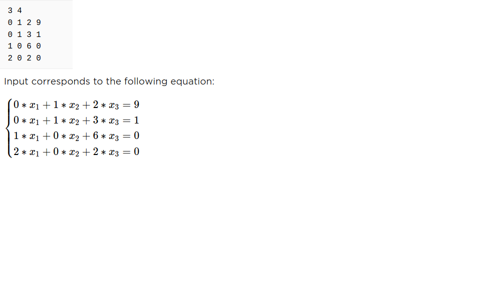

# Linear_Equations_Solver
### This is a console program to solve linear equation systems. It uses command line parameters to read from/save to file.
### Example: 
#### -in in.txt -out out.txt
#### Program reads in inputs from the file in.txt and saves solutions to the file out.txt.

### In order to use the program, user needs to fill in the input file in the following way:
#### - in first line user provides the number of variables (n) and the number of equations (m) separated by space
#### - m lines, each containing n+1 coefficients (example below)
### After filling in the input file, user runs the main() method.

